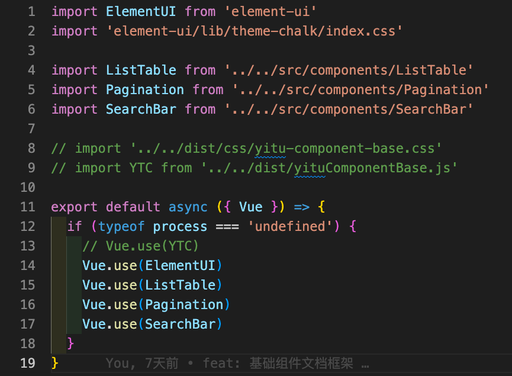

# 启动

## Run

推荐使用 [yarn](https://yarn.bootcss.com/) 的方式安装

```
yarn install
yarn docs:dev
```

## 编写组件
在 **/src/component/** 下新建文件夹Folder(组件名)， 具体目录如下：
- Folder
  - index.js
  - src
    - main.vue

其中 index.js 对外暴露新建的组件
```
import Comp from './src/main.vue'

Comp.install = function(Vue) {
  Vue.component(Comp.name, Comp)
}

export default Comp
```
## 加载组件
在 **docs/.vuepress/enhanceApp.js** 中，将新建的组件注册到Vue，为编写组件文档和演示dome做准备
<div>
  
</div>

## 编写文档
组件文档使用markdown语法编写，编写格式可以参考 **/docs/comps/ListTable.md**

```
1 在目录/docs/comps/下新增对应组件的文档(如：xxx.md)
2 在文件/docs/.vuepress/config.js 的侧边栏sidebar中新增组件路径即可
```

## 组件打包和注册
打包(***用rollup将项目所有组件打包成 **dist/jsbc.js** 后，发布到npm库***)

```
npm run build:vue
npm publish
```

注册( ***npm i jsbc*** )
```
// 全局注册组件
import 'jsbc/dist/css/js-base-components.css'
import JSBC from 'jsbc'
Vue.use(JSBC)

// 局部注册组件
import 'jsbc/dist/css/js-base-components.css'
import { ListTable } from 'jsbc'
```